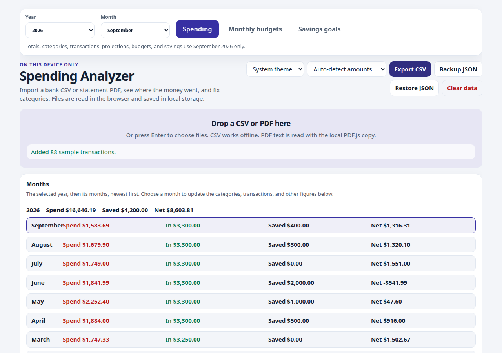
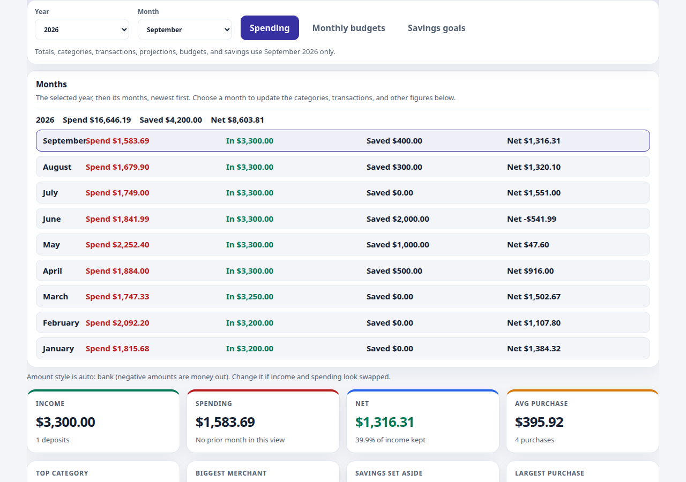
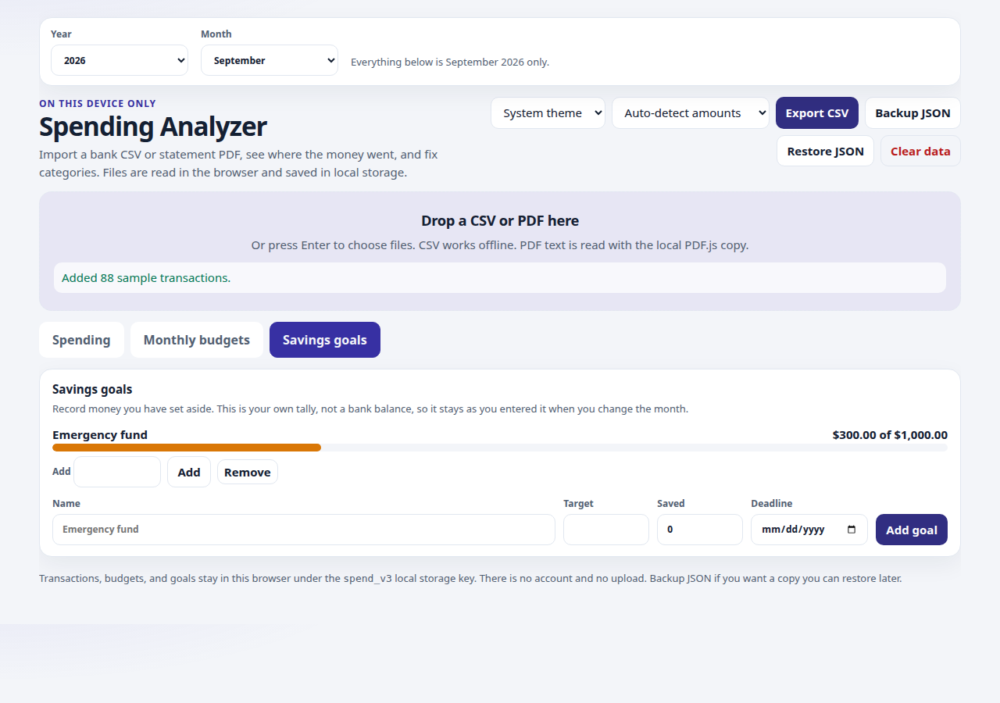
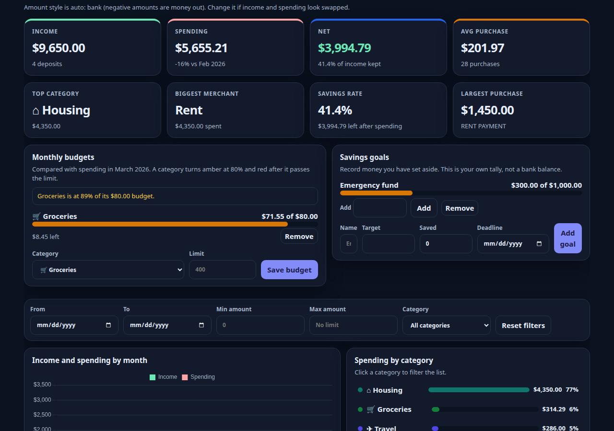

# Spending Analyzer

A private spending, saving, and expense dashboard that runs entirely in the browser. Drop in a bank CSV or a text-based statement PDF, set category budgets and savings goals, and keep a JSON backup. Nothing is uploaded.

Licensed under the [MIT License](LICENSE). Ideas for what comes next are in [ROADMAP.md](ROADMAP.md).

## Features

- Add and remove transactions, and undo a removal
- Import CSV files and text bank-statement PDFs
- Guess categories, then remember the category you pick for a merchant
- Track income, spending, net, and savings rate, with transfers left out of those totals
- Year filter, month filter, and the Spending, Monthly budgets, and Savings goals tabs share one bar at the top of the page. Totals, categories, merchants, transactions, projections, budgets, and savings follow that month. The default is the current month when the data has it, otherwise the latest month
- Under Spending, a year-then-month list comes first. Choosing a month there updates the rest of the page. Categories, the chart, and transactions follow below
- Search, plus date, amount, and category filters inside that month
- Monthly budgets and savings goals on their own tabs, so the spending view stays uncluttered
- Monthly budget per spending category, with an alert at 80% and when the limit is passed
- Savings goals with a target, amount saved, optional deadline, and progress
- Spending and savings projections, labeled as estimates
- A Savings category for money moved to savings or investments, kept out of spending
- Change one transaction’s category without changing the rest, or check “Also all {merchant}” to update every row from that merchant
- Categories for housing, utilities, household help, food, transport, family, education, health, loans, and savings, including common Indian descriptions. Older names such as Groceries and Housing still work
- Export the current view as CSV, or back up and restore everything as JSON
- Light, dark, or system theme
- Built-in sample data so you can try it with no statement

## Screenshots









## Privacy

All of your data stays in the browser.

- Transactions, category choices, theme, filters, budgets, and goals are stored in `localStorage` under the key `spend_v3`.
- Chart.js and PDF.js are files in [`vendor/`](vendor/README.md). The page does not call a CDN.
- There is no account, analytics script, or network upload. A JSON backup is a file you download yourself.

## Run it locally

Opening `index.html` is enough for CSV import and the rest of the dashboard. PDF import is more reliable over HTTP, because the PDF.js worker loads as a separate file:

```bash
python3 -m http.server 8765
```

Then open `http://127.0.0.1:8765/`.

1. Drop a statement on the importer, press Enter on that box to choose files, or **Load sample data**.
2. Check the amount style in the header. **Bank** means negative amounts are money out. **Card** means positive charges are money out. **Auto** looks at purchases it recognizes. Switch the style if income and spending look swapped.
3. Set a merchant’s category in the table. Later rows for that merchant keep it.
4. Use the year and month filters in the top bar, next to the Spending, Monthly budgets, and Savings goals tabs. Under Spending, the months list is first. Totals, categories, transactions, projections, budgets, and savings use the selected month.
5. Open **Monthly budgets** or **Savings goals** from the tabs under the importer. A budget compares with spending in the selected month. A savings goal is a tally you enter yourself. Changing a category updates that row only, unless you check “Also all” for that merchant.
6. **Export CSV** downloads the rows you are looking at. **Backup JSON** downloads the full saved state, and **Restore JSON** replaces what is in this browser.

### CSV files

| Role | Headers it looks for |
| --- | --- |
| Date | Date, Transaction Date, Posted Date, Posting Date |
| Description | Description, Memo, Payee, Name |
| Amount | Amount, or a Debit column and a Credit column |
| Balance | Balance, Running Balance (not treated as the amount) |
| Category | Category, when the value is one of this app’s categories |

A file with no header should be `date, description, amount`. A trailing running-balance column is detected when the balances line up. Quoted commas, a UTF-8 BOM, `;` or tab separators, ISO dates (`2026-01-05`), US dates (`01/05/2026`), `($12.50)`, `12.50 CR`, and a trailing minus (`40.00-`) are supported. Dates are read as month/day/year.

Examples live in [`examples/`](examples/). Re-importing an export from this app works: the file is `Date,Description,Merchant,Category,Amount`, and Amount is the signed number shown in the app (negative means money out).

### PDF statements

PDF text is extracted in the browser. Scanned statements (pages that are only images) will not import. Lines that look like balances, credit limits, or a bare “Total” are skipped. A transaction amount is preferred over a running balance on the same line.

## Deploy on GitHub Pages

There is no build step. From the repository on GitHub:

1. Open **Settings → Pages**.
2. Under **Build and deployment**, choose **Deploy from a branch**.
3. Choose the branch to publish (usually `main`) and the folder **/ (root)**.
4. Save.

The site is served at `https://<user>.github.io/<repo>/`. Styles, scripts, and `vendor/` use relative paths, so they load from that URL. After the page has loaded, CSV import does not need the network. PDF import uses the PDF.js worker that Pages serves with the site.

## Tests

```bash
node --test test/logic.test.js
```

## Contributing

See [CONTRIBUTING.md](CONTRIBUTING.md) and the [Code of Conduct](CODE_OF_CONDUCT.md).

## Limits

- Amounts are shown in US dollars. Mixed currencies are not converted.
- Category guesses are keyword rules. A wrong guess is fixed by setting the merchant’s category.
- A category budget counts money out. A refund does not lower that category’s spent amount.
- PDF layout varies by bank. If a PDF imports nothing useful, export a CSV instead.
- The tool does not connect to a bank, and it does not sync between devices. Use **Backup JSON** for a copy you can restore later.
