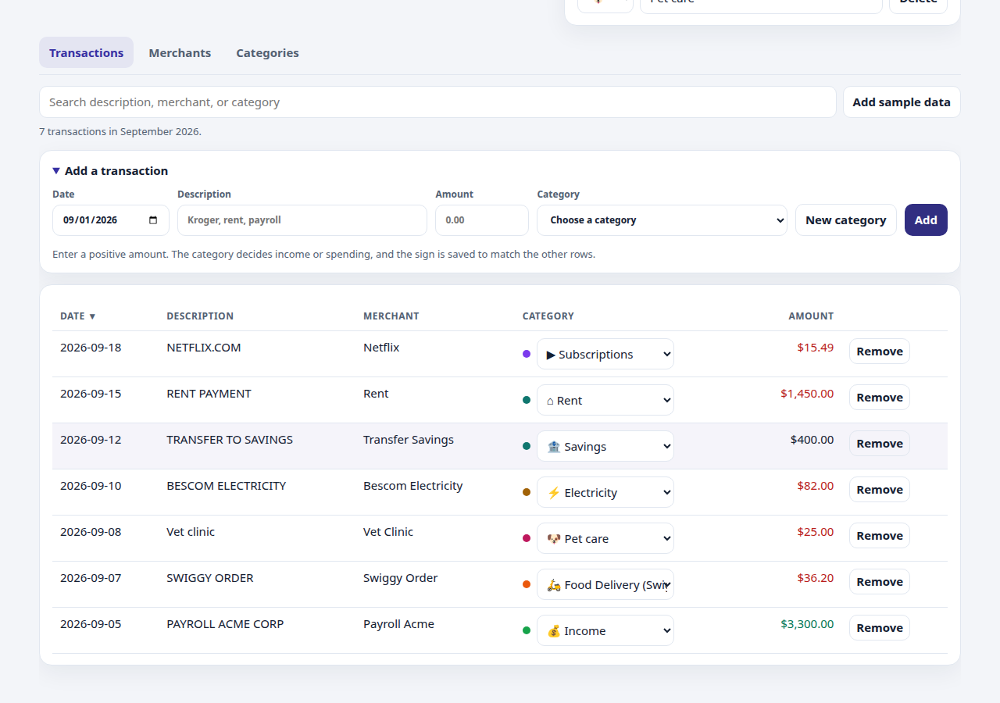
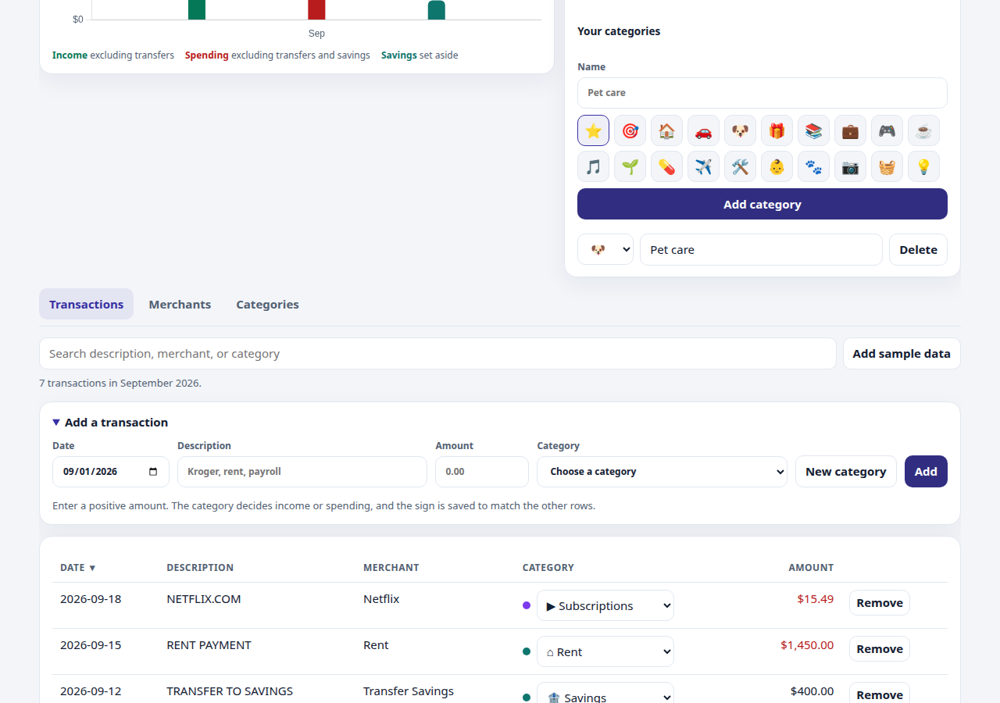
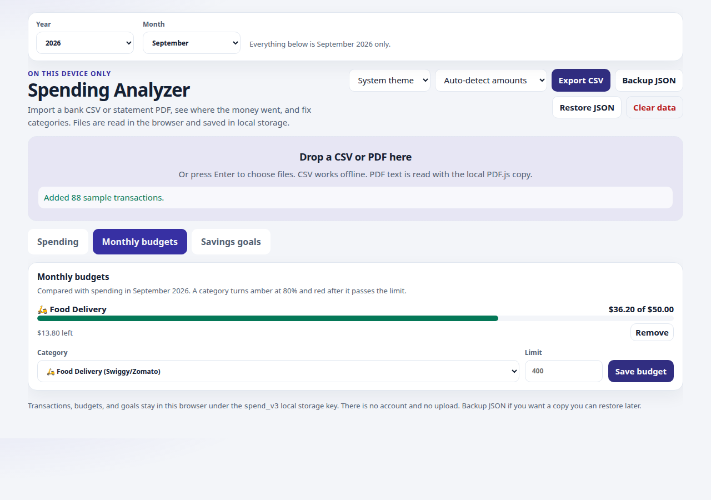
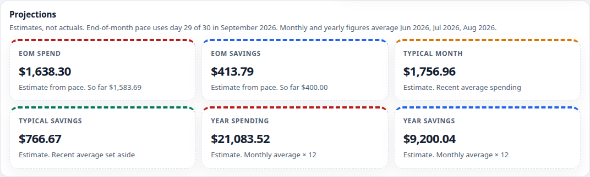
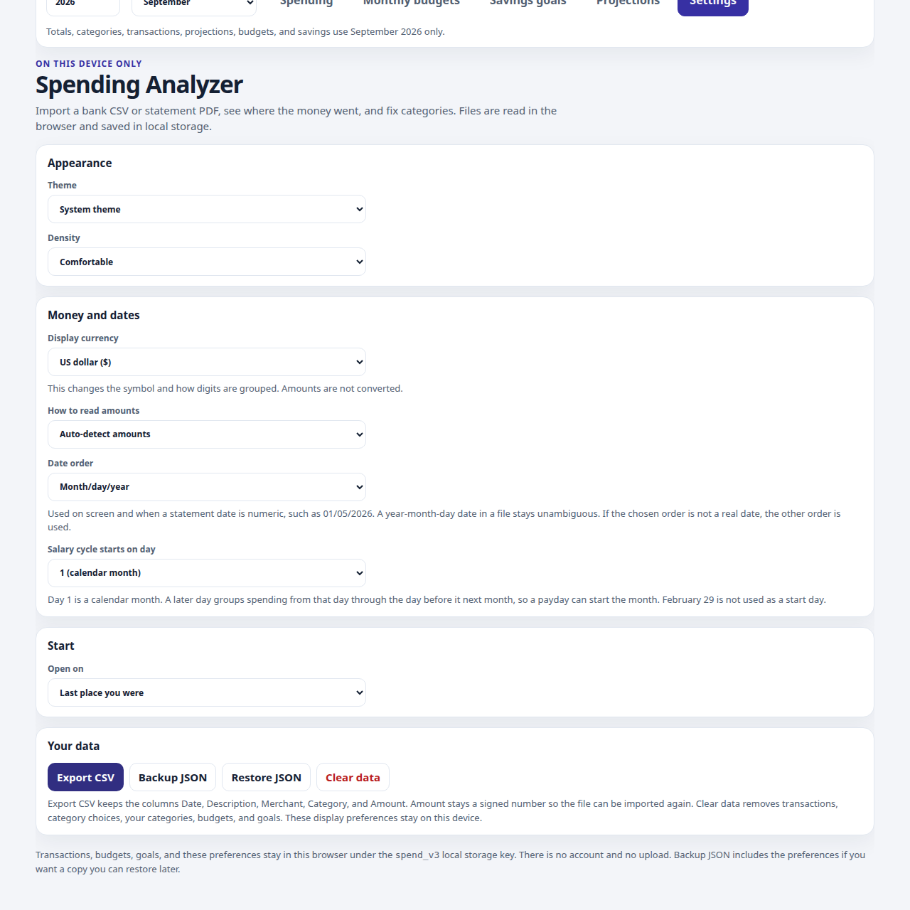

# Spending Analyzer

A private spending, saving, and expense dashboard that runs entirely in the browser. Drop in a bank CSV or a text-based statement PDF, set category budgets and savings goals, and keep a JSON backup. Nothing is uploaded.

The live site is <https://nareshnalla.github.io/spending-analyzer/> (GitHub Pages).

This project is free under the [MIT License](LICENSE). Contributions are welcome. See [CONTRIBUTING.md](CONTRIBUTING.md).

These problems are ready to implement. They are not reserved. [ROADMAP.md](ROADMAP.md) has the same list with a bit more detail.

- Year-over-year comparison: the same calendar month across years.
- Smarter subscription detection: how often a charge repeats, when the price changes, and a flag that it looks like a subscription. A calendar of the next expected rent, bill, or subscription is still open too.
- Multi-currency. Amounts are US dollars only, and mixed currencies are not converted.
- A PWA, so the site can be installed and used offline. There is no manifest or service worker yet.
- Better handling of scanned PDFs. Text PDFs already import. Pages that are only images do not.
- OFX and QFX import.
- Day/month/year dates on statements that are not written month first.
- A refund should be able to lower what a category budget has spent.
- Edit or delete a merchant rule without opening one of that merchant’s transactions.
- The rest of the accessibility pass: a screen reader check, contrast on every state, and a skip link.

Custom categories, with a name and an icon from the built-in set, are already in the app. That is not an open problem.

## How this app grew

I wanted a spending, saving, and expense tracker anyone could run, with no account and no server. I used a Grok Bot called Spend Analyzer to decide what the app should do, and Cursor to make each change on this repo. Every change landed as a pull request on main, and GitHub Pages serves that.

The app stayed plain HTML, CSS, and JavaScript on purpose. There is no build step, so the files you see are the app. Numbers stay in the browser under `spend_v3`. A JSON backup is how they move to another browser. Cloud save was considered and set aside for now.

What kept changing, and why:

- Spending is the first screen. Budgets, savings goals, and projections sit in their own menus.
- A year and a month at the top drive every number. A transaction can be added by hand for any year from 1970 to 2100, including a month that is still empty.
- Amounts are shown as positive numbers. Only an income category counts as income. Rent and the other everyday categories count as spending. Lend, Borrow, and Savings stay out of both.
- Changing a category updates the tables, the chart, and the merchant list, and the change is still there after a refresh. The same merchant is categorized again in the background, with no checkbox.
- Categories grew from real life, including Indian household costs, then parking, subscriptions, car lease, car EMI, a general EMI, car charging, haircut, and body care. A custom category can be added with a name and an icon from a built-in set.
- Date, amount, and category filter boxes were removed. They got in the way more than they helped.

A React rewrite and TanStack were looked at and not taken. A cleaner layout was sketched and left as a sketch. The page in use is still this one.

## For someone using it

Drop in a bank statement, CSV or PDF. Categories are filled in for you. If a few are wrong, change them. That change shows across the app (tables, chart, category totals, and merchants), and the same merchant is categorized the same way next time. It is saved only in this browser. There is no account and no server. Use Backup JSON if you want a copy to move to another browser.

## For someone building on it

Clone or fork the repo and use it. There is no build step. Open index.html, or serve the folder. See [CONTRIBUTING.md](CONTRIBUTING.md). The live site is https://nareshnalla.github.io/spending-analyzer/

## Features

- Add a transaction by hand (date, amount, description, and category) and remove one, with undo for a removal. The amount stays positive; the category decides income or spending
- Import CSV files and text bank-statement PDFs
- Guess categories, then remember the category you pick for a merchant
- Track income, spending, net, and savings rate, with transfers left out of those totals
- The importer is at the top, then the months list, then the year, month, and Spending, Monthly budgets, Savings goals, Projections, and Settings menu. Spending is the default tab. Settings holds the title, theme, amount style, export, backup, and the privacy note. The selected menu follows that month. Type any year from 1970 through 2100 and pick any month, including a month with no transactions yet. The default month is the current month when the data has it, otherwise the latest month
- Search inside the selected month
- Monthly budgets and savings goals on their own tabs, so the spending view stays uncluttered
- Monthly budget per spending category, with an alert at 80% and when the limit is passed
- Savings goals with a target, amount saved, optional deadline, and progress
- Spending and savings projections on their own tab, labeled as estimates, and scoped to the selected month
- A Savings category for money moved to savings or investments, kept out of spending
- Changing a transaction’s category updates every saved row from that same merchant and keeps the choice for later imports. The choice is stored in `spend_v3` on those transactions and as a merchant rule, so a reload keeps it. A different merchant is left alone
- Add your own categories from the category list or from a transaction’s category menu. Each one has a name and an icon from the built-in set. Rename it, change the icon, or delete it. Deleting moves its transactions to Other and keeps the rows. Custom categories are stored in `spend_v3` and are included in Backup JSON and Restore JSON
- Categories for housing, utilities, household help, food, transport (including parking, car lease, and electric car charging), family (including separate Pooja, Devotional, and Festival choices), education, health, loans (including Car EMI and a general EMI), savings, subscriptions (Netflix, Spotify, Prime, Hotstar, YouTube, iCloud, Google One, and gym membership), personal care (Haircut for haircut, hair care, salon, and barber; Body care for body care, spa, and grooming), and lend or borrow, including common Indian descriptions. Older names such as Groceries and Housing still work. Lend and Borrow sit together and are left out of spending and income, the same way transfers are. A Zelle or UPI payment stays a transfer unless the description says lend or borrow
- Export the current view as CSV, or back up and restore everything as JSON
- Light, dark, or system theme
- Built-in sample data so you can try it with no statement

## Screenshots














## Privacy

All of your data stays in the browser.

- Transactions, category choices, custom categories, theme, budgets, and goals are stored in `localStorage` under the key `spend_v3`.
- Chart.js and PDF.js are files in [`vendor/`](vendor/README.md). The page does not call a CDN.
- There is no account, analytics script, or network upload. A JSON backup is a file you download yourself.

## Run it locally

Opening `index.html` is enough for CSV import and the rest of the dashboard. PDF import is more reliable over HTTP, because the PDF.js worker loads as a separate file:

```bash
python3 -m http.server 8765
```

Then open `http://127.0.0.1:8765/`.

1. Drop a statement on the importer, press Enter on that box to choose files, or **Add sample data**.
2. Open **Settings** and check the amount style. **Bank** means negative amounts are money out. **Card** means positive charges are money out. **Auto** looks at purchases it recognizes. Switch the style if income and spending look swapped.
3. Set a merchant’s category in the table. Later rows for that merchant keep it.
4. Below the importer, use the months list, then the year and month and the Spending, Monthly budgets, Savings goals, Projections, and Settings menu. Spending opens first, including when nothing is saved yet, so you can type a transaction. Totals, categories, transactions, projections, budgets, and savings use the selected month. Open **Add a transaction** for a date, description, positive amount, and category.
5. Open **Monthly budgets**, **Savings goals**, **Projections**, or **Settings** from that menu. A budget compares with spending in the selected month. A savings goal is a tally you enter yourself. Projections are estimates for that same month. Settings has the theme, amount style, export, backup, and the note that data stays in this browser. Changing a category updates the other rows from that same merchant, and later imports of that merchant keep it.
6. **Export CSV** downloads the rows you are looking at. **Backup JSON** downloads the full saved state, and **Restore JSON** replaces what is in this browser.

### CSV files

| Role | Headers it looks for |
| --- | --- |
| Date | Date, Transaction Date, Posted Date, Posting Date |
| Description | Description, Memo, Payee, Name |
| Amount | Amount, or a Debit column and a Credit column |
| Balance | Balance, Running Balance (not treated as the amount) |
| Category | Category, when the value is one of this app’s categories |

A file with no header should be `date, description, amount`. A trailing running-balance column is detected when the balances line up. Quoted commas, a UTF-8 BOM, `;` or tab separators, ISO dates (`2026-01-05`), US dates (`01/05/2026`), `($12.50)`, `12.50 CR`, and a trailing minus (`40.00-`) are supported. Dates are read as month/day/year.

Examples live in [`examples/`](examples/). Re-importing an export from this app works: the file is `Date,Description,Merchant,Category,Amount`, and Amount stays signed (negative means money out). On screen every amount is positive. Green is an income category and red is spending. Lend, Borrow, and Savings stay out of both.

### PDF statements

PDF text is extracted in the browser. Scanned statements (pages that are only images) will not import. Lines that look like balances, credit limits, or a bare “Total” are skipped. A transaction amount is preferred over a running balance on the same line.

## Deploy on GitHub Pages

There is no build step. From the repository on GitHub:

1. Open **Settings → Pages**.
2. Under **Build and deployment**, choose **Deploy from a branch**.
3. Choose the branch to publish (usually `main`) and the folder **/ (root)**.
4. Save.

The site is served at `https://<user>.github.io/<repo>/`. Styles, scripts, and `vendor/` use relative paths, so they load from that URL. After the page has loaded, CSV import does not need the network. PDF import uses the PDF.js worker that Pages serves with the site.

## Tests

```bash
node --test test/logic.test.js
```

## Contributing

The live site is <https://nareshnalla.github.io/spending-analyzer/> (GitHub Pages).

This project is free under the [MIT License](LICENSE). Contributions are welcome. See [CONTRIBUTING.md](CONTRIBUTING.md) and the [Code of Conduct](CODE_OF_CONDUCT.md).

These problems are ready to implement. They are not reserved. [ROADMAP.md](ROADMAP.md) has the same list with a bit more detail.

- Year-over-year comparison: the same calendar month across years.
- Smarter subscription detection: how often a charge repeats, when the price changes, and a flag that it looks like a subscription. A calendar of the next expected rent, bill, or subscription is still open too.
- Multi-currency. Amounts are US dollars only, and mixed currencies are not converted.
- A PWA, so the site can be installed and used offline. There is no manifest or service worker yet.
- Better handling of scanned PDFs. Text PDFs already import. Pages that are only images do not.
- OFX and QFX import.
- Day/month/year dates on statements that are not written month first.
- A refund should be able to lower what a category budget has spent.
- Edit or delete a merchant rule without opening one of that merchant’s transactions.
- The rest of the accessibility pass: a screen reader check, contrast on every state, and a skip link.

Custom categories, with a name and an icon from the built-in set, are already in the app. That is not an open problem.

## Limits

- Amounts are shown in US dollars. Mixed currencies are not converted.
- Category guesses are keyword rules. A wrong guess is fixed by setting the merchant’s category.
- A category budget counts money out. A refund does not lower that category’s spent amount.
- PDF layout varies by bank. If a PDF imports nothing useful, export a CSV instead.
- The tool does not connect to a bank, and it does not sync between devices. Use **Backup JSON** for a copy you can restore later.
